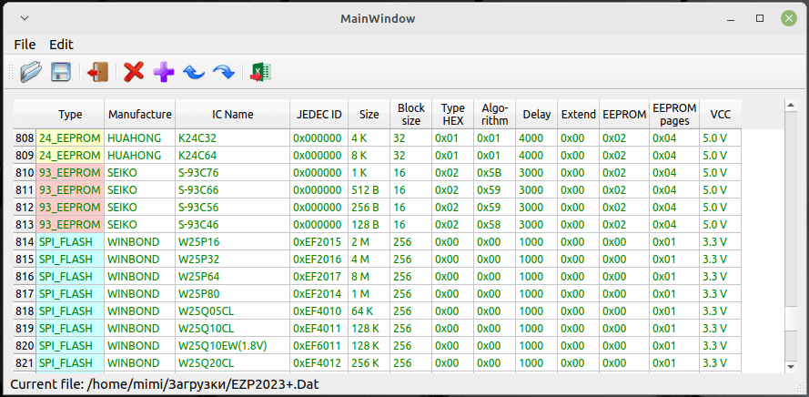

# EZP2019–EZP2025 Chip Data Editor

**English** | [فارسی](#فارسی)

Qt based chip database editor for **EZP2019, EZP2019+, EZP2020, EZP2023, EZP2025, MinPro, XP866+, MinproI** and other compatible programmer devices.



---

## ✨ Features

- 📖 **Open** the chip database file of your programmer device (`EZP2019.Dat`, `EZP2023+.Dat`, `EZP2025.Dat`, `XP866+.Dat`, `MinproI.Dat` — depending on your device).
- 💾 **Save** all changes back to the binary database file.
- 🗑️ **Delete** one or more selected records.
- ⬆️⬇️ **Move** the selected records up or down with the arrow buttons.
- ➕ **Copy / duplicate** the selected record.
- 📤 **Export** the selected records — or the whole database — to **CSV** (Excel-compatible).
- 📥 **Import** records from a **CSV** file back into the database.
- ✏️ **Every cell is fully editable.**

---

## 🖥️ Usage

| Action | How |
|---|---|
| Open database | Press the  button — the file name depends on your programmer device (`EZP2019.Dat`, `EZP2023+.Dat`, `EZP2025.Dat`, `XP866+.Dat`, `MinproI.Dat`) |
| Save changes | Press the save  button |
| Delete records | Select one or more records, then press the delete button  |
| Move records | Select a record and use the arrow buttons ( and ) |
| Copy record | Press the plus button  |
| Selected records → CSV | Press the button  |
| Export whole database → CSV | `File` menu → `Export to CSV`  |
| Import records from CSV | `File` menu → `Import from CSV`  |

> ℹ️ Any cell is editable — just click and type.

---

## 🔨 Building

### Linux / macOS

```bash
mkdir build
cd build
cmake ..
make -j4
sudo make install
```

### Windows (Qt + MinGW / MSVC)

```bash
mkdir build
cd build
cmake .. -G "MinGW Makefiles"
mingw32-make -j4
```

### Qt Creator

You can also simply open `CMakeLists.txt` or the `.pro` file in **Qt Creator** and build from there.

### Requirements

- **Qt 5 / Qt 6**
- **CMake** (or qmake via the `.pro` file)

---

## 📄 License

This project is licensed under the **GPL-3.0** License — see the [LICENSE](LICENSE) file for details.

---

# فارسی

[English](#ezp2019ezp2025-chip-data-editor) | **فارسی**

ویرایشگر پایگاه‌داده چیپ‌ها برای مبرد برنامه‌ریزهای **EZP2019، EZP2019+، EZP2020، EZP2023، EZP2025، MinPro، XP866+، MinproI** و دستگاه‌های سازگار دیگر.


---

## ✨ امکانات

- 📖 **باز کردن** فایل پایگاه‌داده چیپ‌های دستگاه مبرد شما (`EZP2019.Dat`، `EZP2023+.Dat`، `EZP2025.Dat`، `XP866+.Dat`، `MinproI.Dat` — بسته به نوع دستگاه).
- 💾 **ذخیره** تمام تغییرات به‌صورت فایل باینری پایگاه‌داده.
- 🗑️ **حذف** یک یا چند رکورد انتخاب‌شده.
- ⬆️⬇️ **جابه‌جایی** رکورد انتخاب‌شده به بالا یا پایین با دکمه‌های فلش.
- ➕ **کپی** کردن رکورد انتخاب‌شده.
- 📤 **خروجی گرفتن** از رکوردهای انتخاب‌شده — یا کل پایگاه‌داده — به فرمت **CSV** (سازگار با اکسل).
- 📥 **ورود اطلاعات** از فایل **CSV** به داخل برنامه.
- ✏️ **تمام سلول‌ها قابل ویرایش هستند.**

---

## 🖥️ نحوه استفاده

| عمل | روش |
|---|---|
| باز کردن پایگاه‌داده | دکمه  را بزنید — نام فایل بسته به دستگاه مبرد شما متفاوت است (`EZP2019.Dat`، `EZP2023+.Dat`، `EZP2025.Dat`، `XP866+.Dat`، `MinproI.Dat`) |
| ذخیره تغییرات | دکمه ذخیره  را بزنید |
| حذف رکوردها | یک یا چند رکورد را انتخاب کنید و دکمه حذف  را بزنید |
| جابه‌جایی رکوردها | رکورد مورد نظر را انتخاب کنید و از دکمه‌های فلش ( و ) استفاده کنید |
| کپی رکورد | دکمه بعلاوه  را بزنید |
| تبدیل رکوردهای انتخابی به CSV | دکمه  را بزنید |
| خروجی گرفتن از کل پایگاه‌داده به CSV | منوی `File` → گزینه `Export to CSV`  |
| ورود اطلاعات از فایل CSV | منوی `File` → گزینه `Import from CSV`  |

> ℹ️ هر سلول قابل ویرایش است — کافیست کلیک کنید و تایپ کنید.

---

## 🔨 ساخت (Build)

### لینوکس / macOS

```bash
mkdir build
cd build
cmake ..
make -j4
sudo make install
```

### ویندوز (Qt + MinGW / MSVC)

```bash
mkdir build
cd build
cmake .. -G "MinGW Makefiles"
mingw32-make -j4
```

### Qt Creator

همچنین می‌توانید فایل `CMakeLists.txt` یا فایل `.pro` را در **Qt Creator** باز کنید و از همان‌جا برنامه را Build کنید.

### پیش‌نیازها

- **Qt 5 / Qt 6**
- **CMake** (یا qmake از طریق فایل `.pro`)

---

## 📄 لایسنس

این پروژه تحت لایسنس **GPL-3.0** منتشر شده است — برای جزئیات فایل [LICENSE](LICENSE) را ببینید.

